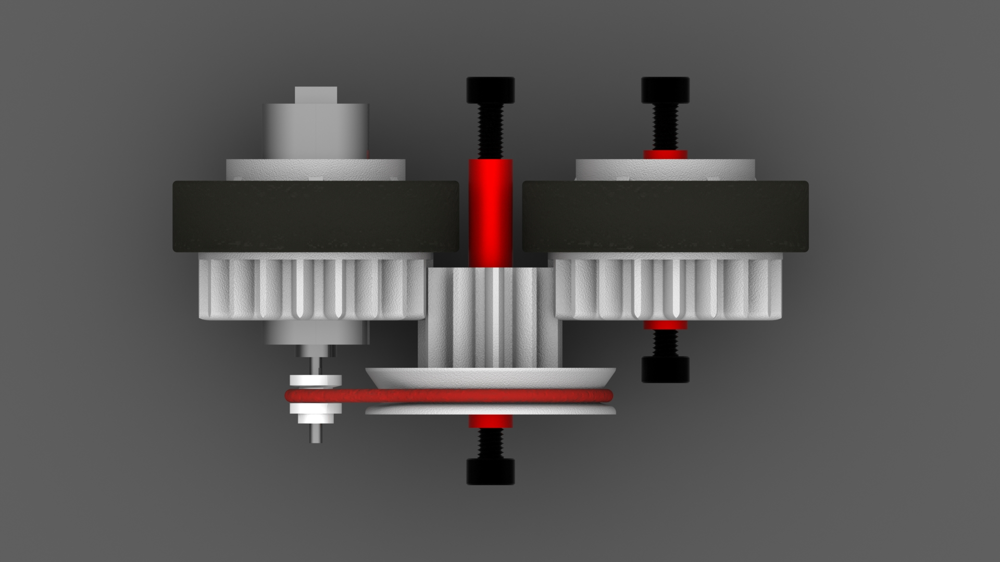
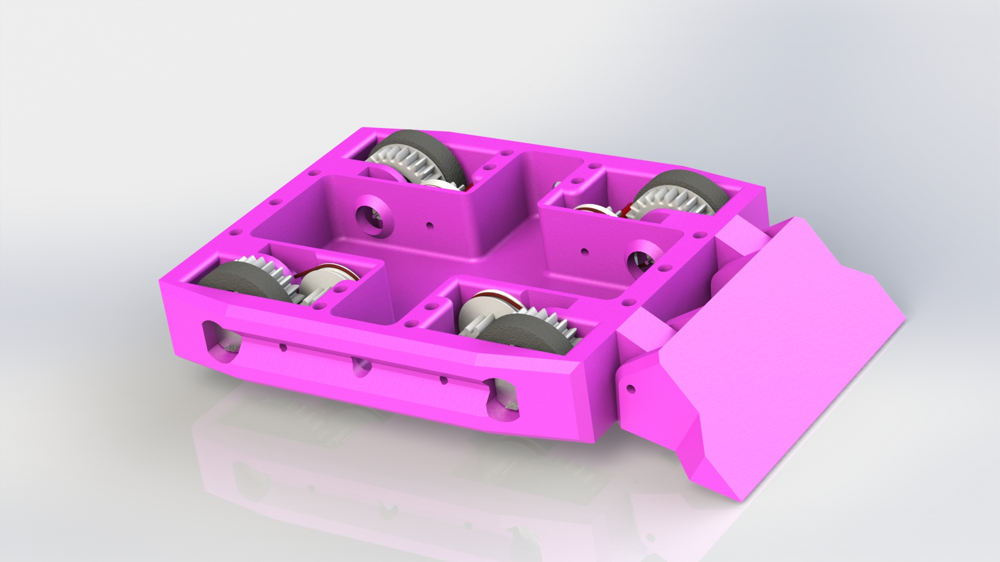
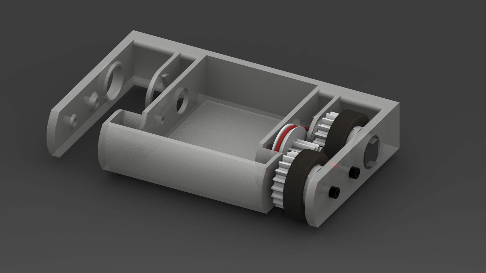

# cherry-bomb

Cherry-Bomb is an open source combat robotics project.  Cherry-Bomb uses mabuchi 050 motors in a unique configuration to improve durability:

The 050 motor is used as the drive shaft.  The required gear reduction is achieved with one stage of belt reduction and then one stage of gear reduction.  The Wheels, and Drive pulley are designed to be 3d printed.  This configuration yields a fairly compact, and extremely durable drivetrain.

Bennifits:

* Cost less than 5$ per wheel.
* Using drive motor as an axle reduces size and increases strength
* Oversized 3d printed design is easy to fix, and extremely durable
* Belt incorporated into the design acts as a clutch, reducing likelyhood of impact damage to motor.

Downsides:

* Bulky
* Requires armor around the entire assembly, potentially increasing weight

This exact design has been used in 3 robots so far, with 0 failures.  Here are some context photos:

A 4wd wedge design.  COmpeted as 'Kirby' in ARC-2018.

A test frame for a faster gear ratio.
